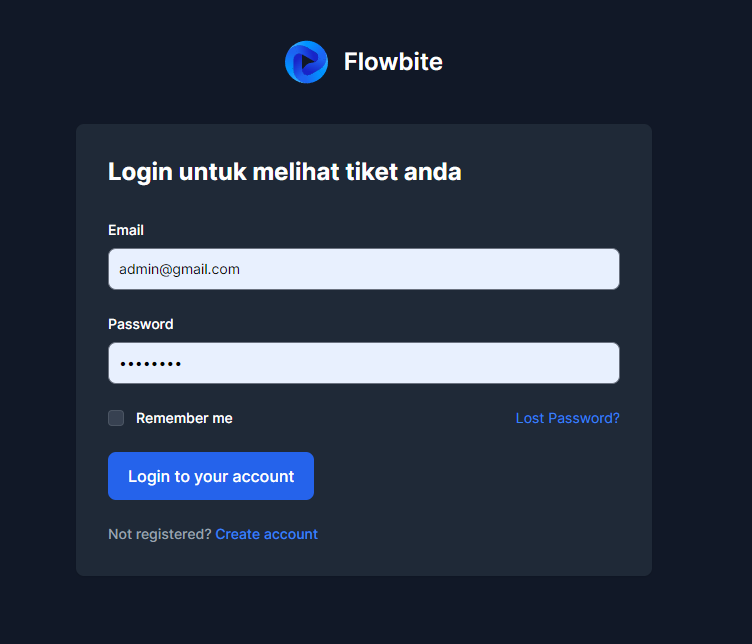
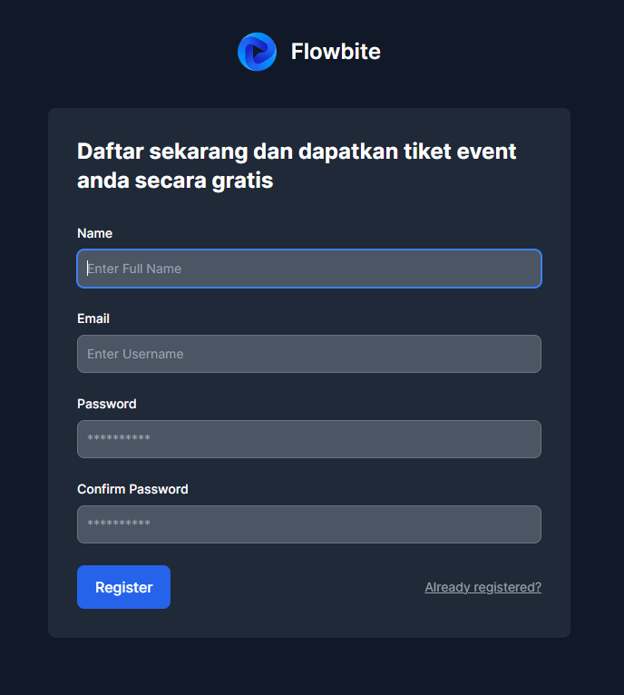
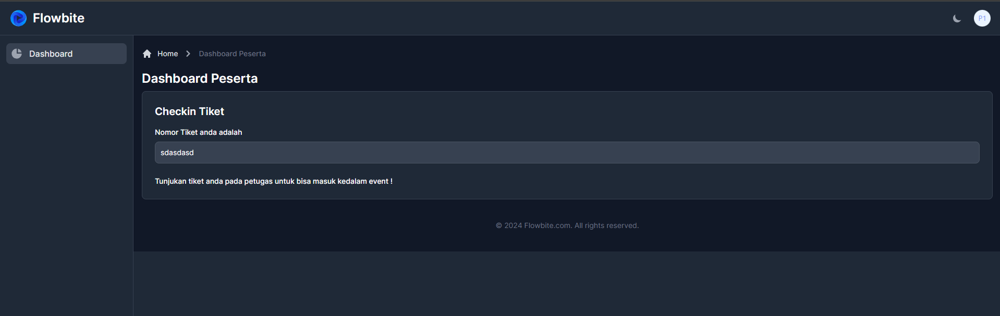
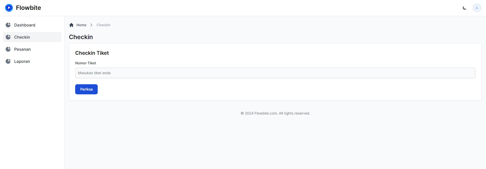
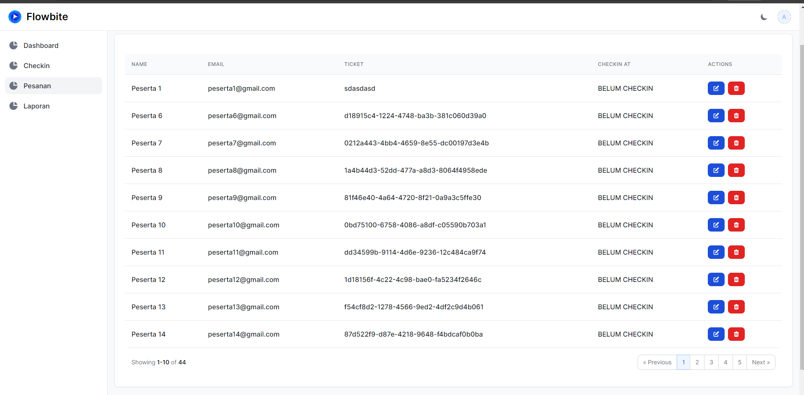
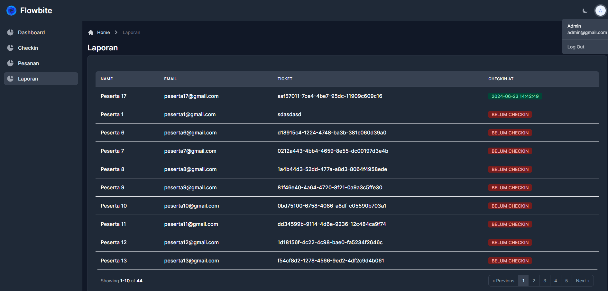

# Tes WEB PROGRAMMER (PHP) PT. Transindo Data Perkasa

## Deskripsi

Aplikasi Tes WEB PROGRAMMER (PHP) untuk PT. Transindo Data Perkasa. Detail soal tes di [soal.pdf](soal.pdf).

## Setup Lingkungan Pengembangan

Pastikan Anda menggunakan bundle pack Laragon versi Full 6.0 dengan persyaratan berikut:****

- **Maria DB** versi 10.5
- **PHP** versi 8.2.16
- **Node.js** versi 18.8.0
- **NPM** versi 8.18.0

## Instruksi Instalasi

Clone repositori ini ke dalam direktori lokal Anda:

```bash
    git clone 
    copy .env.example .env
    npm run dev 
    php artisan serve
 ```

 ## Seed
 
 Jalankan command `php artinan migrate --seed`
 Default akan membuat:
 1. Admin 1 (email : admin@gmail.com)
 2. Peserta 50 (email: peserta1@gmail.com) peserta2,3 dst sampai 50
 

 ## Dokumentasi
  <div style="display: grid; grid-template-columns: repeat(2, 1fr); gap: 20px;">
    
    
    
    
    
    
</div>
